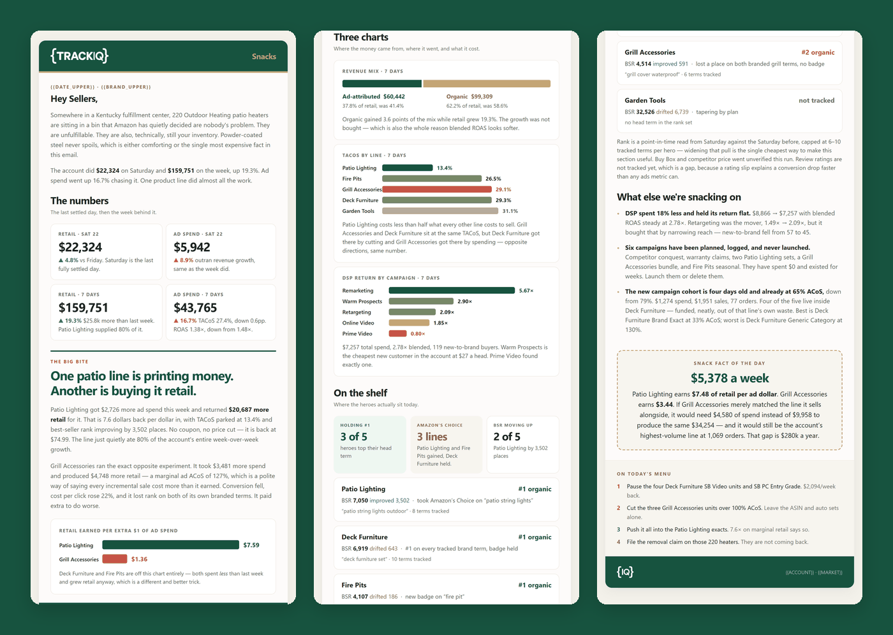

# TrackIQ: Amazon Daily Snacks Email

A daily Amazon advertising email your team will actually read start to
finish. Not a dashboard export — an editorial three-minute brief that
argues one point, backs it with numbers, and ends with a to-do list.

Built as an [Agent Skill](https://code.claude.com/docs/en/skills). Runs in
Claude Code, Claude web, Claude desktop and ChatGPT from the same folder.

---

## Powered by the TrackIQ MCP

[](https://trackiq.com/mcp)

These skills read your live Amazon account through the
**[TrackIQ MCP](https://trackiq.com/mcp)** — 16 tools connecting your AI
assistant to Amazon data:

Sales & Traffic · Orders · Inventory · Returns · Sponsored Products · Sponsored
Brands · Sponsored Display · Amazon DSP · AMC Cloud · Keywords · Search Terms ·
Targeting · Search Query Performance · Organic Rank · Best Seller Rank · Buy Box
History · Brand Analytics · Export


Works with Claude, ChatGPT and Cursor. **[Get access →](https://trackiq.com/mcp)**

---

## What you get



*One send, three views: the cold open and KPI cards, the charts, then the shelf, the Snack Fact and the day's menu.*

One self-contained `.html` email, table-based and inline-styled, that
renders in Outlook and Apple Mail without a build step.

| Section | What it does |
|---|---|
| **Hey Sellers** | Cold open on a real detail, then the headline numbers in one sentence |
| **The numbers** | Retail and ad spend for the settled day, then the same pair for the week |
| **The Big Bite** | The one story worth telling, with a chart |
| **The Takeaway** | The verdict, and where the money actually is |
| **Quick Bites** | Four cards, one number and one implication each |
| **The Scoreboard** | Best line, worst line, biggest leak |
| **Every line, ranked** | One card per product line with a plain-English verdict |
| **Charts** | Revenue mix, TACoS by line, DSP return — each captioned with its takeaway |
| **On the shelf** | Rank, BSR movement, badge state and head term per hero ASIN |
| **Snack Fact** | One number nobody computed — an efficiency gap annualised, a cost of inaction |
| **On today's menu** | Numbered actions, colored by type: cut, fund, admin |

The thing that makes it worth reading is the marginal return comparison —
Δretail ÷ Δspend per product line. That spread is in no standard report,
and it is usually the story.

## Requirements

- The **TrackIQ MCP**, for `get_account_overview`, `get_campaigns`,
  `get_product_performance` and `get_bsr`
- Nothing else. No filesystem, no shell, no internet.

**Without the MCP connected** the skill asks you to paste yesterday's
spend, sales, orders, ACOS and rank figures, and builds from those. Any
figure you can't supply is omitted rather than estimated.

---

## Install

### Claude Code — one command, updates itself

```
/plugin marketplace add TrackIQ-HQ/amazon-seller-skills
/plugin install trackiq-amazon-daily-snacks-email@trackiq
```

New versions arrive on their own. This is the path to use if you have it.

### Claude web, desktop, mobile

1. Download `trackiq-amazon-daily-snacks-email.zip` from the
   [latest release](https://github.com/TrackIQ-HQ/trackiq-amazon-daily-snacks-email/releases)
2. **Settings → Capabilities → Skills** (code execution must be on)
3. **Create skill → Upload a skill**, choose the `.zip`
4. Toggle it on

### ChatGPT

Same zip. **Plugins → Skills → Create → Upload from your computer.**
Skills are a Business / Enterprise / Edu feature — personal plans can't
upload them yet.

### Anything else

Unzip into wherever your agent reads skills from — `~/.claude/skills/`, a
Codex `capability_directories` path, an agent sandbox. It's the open Agent
Skills format with no TrackIQ-specific runtime.

---

## Setup

The skill interviews you once, on first run, and never asks again.

1. **Brand name** for the eyebrow, and the account name for the footer
2. **Marketplace** — US, UK, DE
3. **Hero ASINs** — the three to five products that get shelf cards
4. **Product lines** — how your ASINs group for the ranked section
5. **Send day convention** — which weekday the settled day usually lands on
6. **Delivery** — in-chat, file, Slack, n8n or email

Answers go in `account.md`, copied from
[`assets/account.example.md`](skills/trackiq-amazon-daily-snacks-email/assets/account.example.md).
Fill it in ahead of time and the skill skips the interview entirely.

On Claude web and ChatGPT there's no writable filesystem, so the skill
prints the same block and asks you to paste it into your project
instructions once. Same result.

Point 4 matters more than it looks. No API knows that three ASINs are one
product line to you, and the ranked section is only as good as that
grouping.

## Delivery

Where the finished report goes is asked once at setup and stored in
`account.md`. The report is always produced in the chat first; delivery is
the last step.

| Method | What happens | Needs |
|---|---|---|
| **In-chat** | The HTML comes back in the conversation. Default. | nothing |
| **File** | Saved beside the skill, dated. | a filesystem |
| **Slack** | Headline and decisions posted as text, HTML attached as a file. | a connected Slack tool |
| **n8n** | POSTed to your webhook as `text/html`, status reported back. | network access |
| **Email** | Handed to your connected mail tool. | a connected mail tool |

Slack, n8n and email publish outside the chat, so the skill shows you the
channel or recipient and waits for a yes before the first send of a
session. If the configured method isn't available in whatever runtime
you're in, you get the report in-chat with a note saying what was skipped —
it never silently switches to a different outward channel.

## Customizing

| To change | Edit |
|---|---|
| Brand, ASINs, product lines, marketplace | `account.md` — no skill edits |
| Tone and sharpness | `assets/voice.md` |
| Section order, or drop a section | `assets/structure.md` |
| Colors, type scale, geometry | `assets/tokens.md` |
| The email shell itself | `assets/template.html` |

`voice.md` is the highest-leverage file. It's what stops the output
reading like every other AI-written report — no "let's dive in", no
exclamation marks, no grading performance against goals it invented.

Two rules are load-bearing and worth leaving alone. **Every aggregate must
survive the detail printed beneath it** — a tile claiming "4 of 5 hold #1"
above a card showing #2 is the failure that costs you the reader.
**12px minimum for anything that reads as a sentence** — this was the most
repeated review note in the format's history.

---

## Contributing

```bash
python scripts/validate.py    # must exit 0 before any commit
python scripts/build.py       # writes dist/ zips + registry.json
```

`validate.py` enforces the TrackIQ Skill Standard — frontmatter keys,
name rules, asset references, version agreement between `skill.json` and
the body. It gates CI, so a skill that would fail silently in someone's
account fails loudly here first.

Read [AUTHORING.md](https://github.com/TrackIQ-HQ/amazon-seller-skills/blob/main/AUTHORING.md)
before proposing changes. Every rule in it came from something that broke.

## License

MIT. See [LICENSE](LICENSE).
